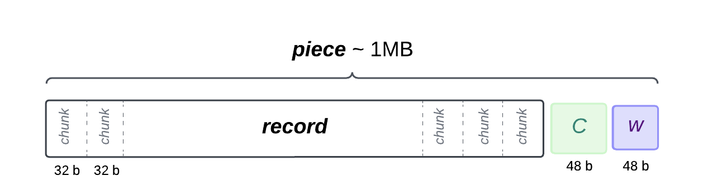

**Archiving** is one of the three core processes in the Subspace consensus. It transforms the chain blocks at a configured depth (currently 100 blocks) from the tip of the chain into a canonical history ready to be distributed to farmers for storage.

The Archiving construction is primarily based on the paper **[Information Dispersal with Provable Retrievability for Rollups](https://eprint.iacr.org/2021/1544)**. The key idea we inherit from this paper is to view the data to be archived as a matrix and a “1.5D approach” with column-wise erasure coding and row-wise KZG commitment.

Combining the polynomial nature of the Reed-Solomon erasure code and KZG with the homomorphic properties of KZG guarantees consistency, retrievability, and efficient verifiability of the archived data.

## Background

When a block reaches archiving depth, its contents are added to a raw chain history buffer. Then, the buffer is sliced into *records*. 

A *record* of blockchain history is a vector of $2^{15}$ *chunks*.

A *chunk* is Subspace’s smallest atomic unit of data measurement. A *chunk* is a field element for KZG and is 254 bits in size. We usually round it up to 32 bytes by padding with zero for convenience. 

A *piece* is a *record* concatenated with a *KZG commitment* and a *witness* of inclusion in a specific *segment*.
<!--  -->

The Archiving process produces *segments* of *pieces*.

## Workflow

The blockchain history data is eligible for archiving when it reaches the archiving depth to ensure no forks and reorganizations. We currently archive segments of raw blockchain history of size 128 MiB, and the archiving process is triggered as soon as there are enough blocks at the current archiving depth of at least 100 blocks from the tip to fill a segment. The Archiver performs the following steps:

1. Slice the Recorded History Segment into 128 source records, stacked on top of one another into a matrix (each row is a record).
2. Commit to chunks of each source record (each row) under the KZG vector commitment scheme.
3. Erasure code each column by interpolating a polynomial over the source record chunks in that column and evaluating that polynomial on twice as many points. As a result, the matrix now has twice as many rows - 256 and consists of 128 source and 128 extended (parity) records.
4. Erasure code the source record commitments similarly by interpolating a polynomial over the source record commitments in that column and evaluating that polynomial on twice as many points.

Step 4 allows us to show that the erasure coding of data was performed correctly with the homomorphic property of Reed-Solomon erasure code and KZG. As a result, the extended commitments (the yellow ones on the diagram below) obtained by erasure-coding the source commitments are the same as if we were to commit to the extended rows.

After step 4, the Archiver has produced 256 records and 256 commitments to those records. 

5. To tie them together into a segment, commit to the record commitments, and obtain the segment commitment. 
6. Compute a witness for each record commitment inclusion in the segment commitment.

With this two-tier commitment, we can later show that a given chunk belongs to a specific record and that record belongs to an archived segment and, thus, to the canonical history of the chain.

7. Build 256 pieces: Each *piece* consists of a *record* of 1 MiB, a 48-byte commitment to record data and a 48-byte witness of inclusion in a segment.
8. Append the new pieces to the canonical history and store the segment commitment in the chain state. 

The segment commitment is also included in the successive segment to link back to the last segment and form the chain of segments that represent the canonical history of the blockchain.

Once a segment has been archived and the pieces are ready for the farmers to store, the next phase is Plotting.
