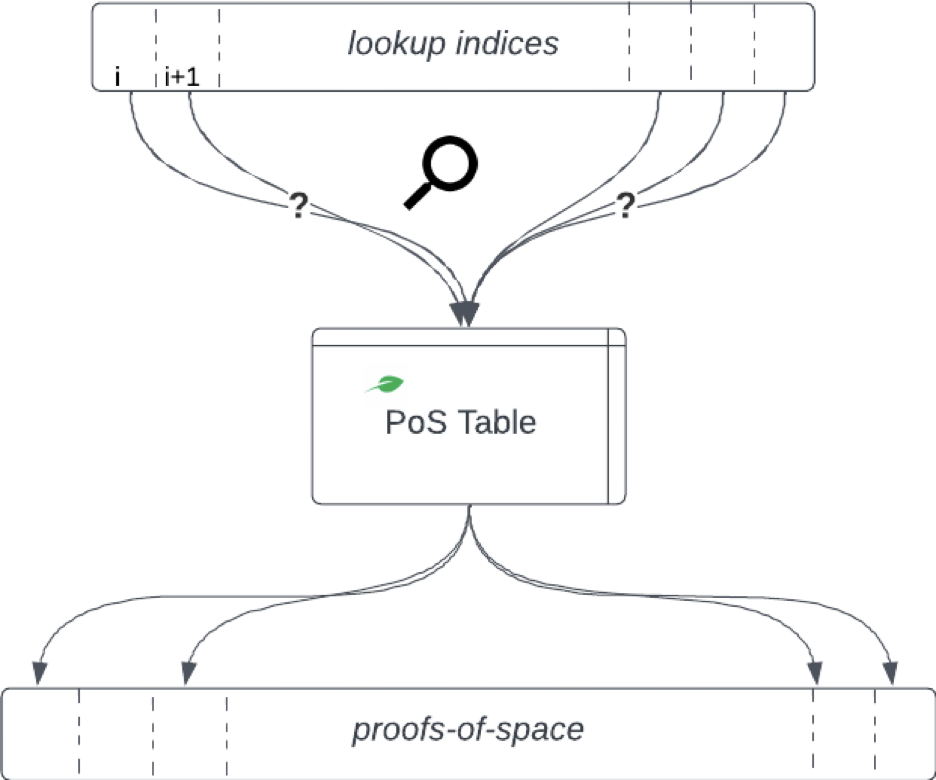
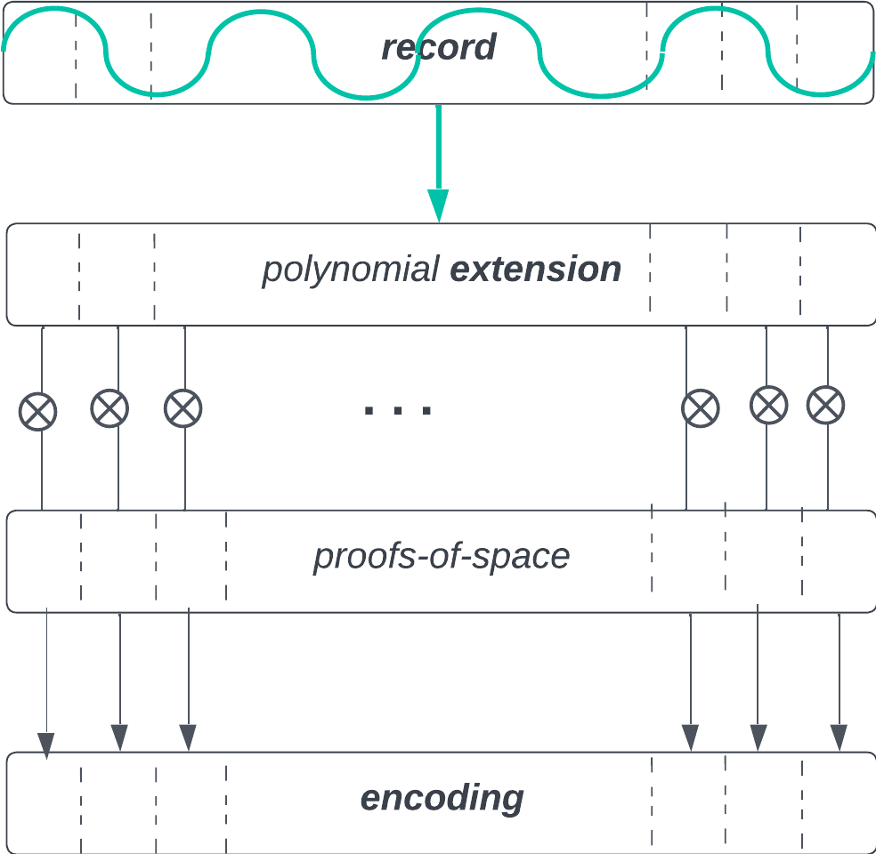
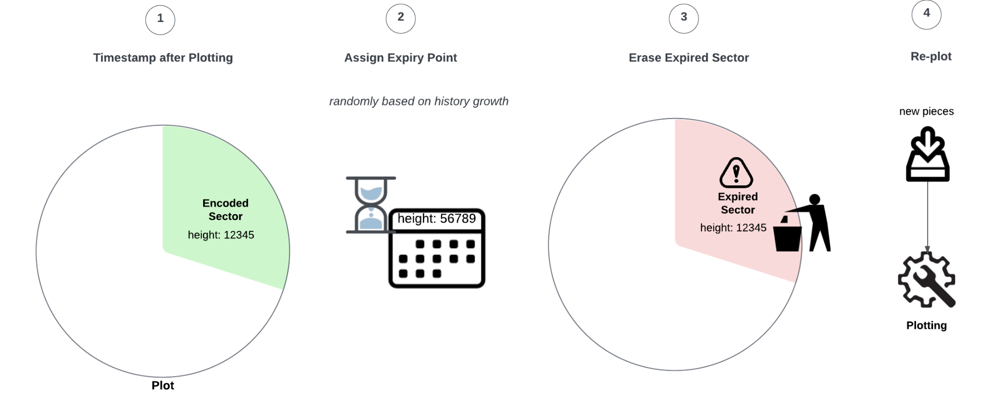

Plotting is the process of creating and maintaining plots on a disk.
The Plotting protocol used in *Dilithium* is based on two core ideas: erasure coding and memory-bandwidth-bound encoding. Erasure coding helps protect the data against loss in the event of failures and network partitions. Memory-bandwidth-bound encoding is a more ecological and economical alternative to proofs-of-work while providing provable time/memory trade-offs and security guarantees. Combining these two ideas allows us to create unique and provable replicas for each farmer that are difficult to fake with computation or to compress. This scheme also makes scanning and verifying the plots easier, ensuring the history data is recoverable.

During this phase, the pieces are gathered and organized into a plot of several sectors. Each sector contains an encoded replica of a uniformly random sample of pieces across all archived history. This sampling ensures that the data is distributed among the farmers proportionally to their pledged disk space and replicated evenly.

## Proof-of-Space Encoding

The memory-bandwidth bound encoding construction comes from the paper **[Beyond Hellman's Time-Memory Trade-Offs with Applications to Proofs of Space](https://www.semanticscholar.org/paper/Beyond-Hellman's-Time-Memory-Trade-Offs-with-to-of-Abusalah-Alwen/39e70d67eeb5ce140171f6d0629daec3b54d74f3)** which is a part of the [Chia](https://www.chia.net/) protocol. We adopt a custom implementation of the Chia Proof-of-Space plotting function as a memory-bandwidth-bound function to encode, or “mask,” the pieces in the farmer plot.

In short, the PoS plotter generates a table of permuted outputs from a set of random functions. The table size is determined by a memory bandwidth requirement parameter, *k*, and the random functions are determined by a *seed*. When challenged at an *index*, the table outputs a short *proof-of-space* that can be efficiently verified.
We do not use the proof-of-space directly to verify that a farmer has pledged a certain amount of space, as Chia does. Instead, we use it to prove that a farmer utilized the required memory bandwidth for encoding the plot.

<!--  -->

## Workflow

A plot can cover the entire disk or span across multiple disks, and there is no limit to the amount of storage a farmer can pledge to the network. Plots consist of equally-sized sectors, currently around 1 GiB each. Each sector is a pseudorandom selection of 1,000 pieces, uniformly sampled throughout history up to that point. For example, if the farmer creates a new sector when the history consists of 50,000 pieces (50 GiB), the 1,000 pieces for this sector will be a uniform selection from the existing 50,000 pieces.

In addition, the farmer must save the current history size, as it will determine the point in the future when the sector will need to be updated with newer pieces. 

<!--  -->

Once the farmer has obtained all 1,000 pieces for this sector from the network, they can create an encoded replica. Only the piece’s historical data, the record part, is encoded. The KZG commitment and witness included in a piece are saved separately in the sector metadata, as they will be needed later for farming.

For each record, the Plotting algorithm performs the following steps:

1. Erasure code (extend) the record data by interpolating a polynomial over chunks of the record. 
2. Derive a unique pseudorandom and verifiable *seed*.
3. Based on this *seed*, generate a proof-of-space table using memory bandwidth resources set by the global protocol memory requirement parameter *k*. This memory-intensive computation prevents malicious farmers from creating replicas after the new block challenge is announced, making it more rational for them to store the replica rather than try to compute it on the fly every time.
4. Query the generated table for enough ($2^{15}$) proof-of-space values to mask every chunk of the record.

<!--  -->

5. Encode each extended record chunk by XOR-masking it with the corresponding proof-of-space value.

<!--  -->

After all records in the sector have been encoded as described, the farmer spreads them into s-buckets chunk-wise. Ultimately, each bucket will contain chunks from all records. The first bucket will have the first chunks of each record; the second bucket will have the second chunks, and so on. The s-buckets are then written to disk, and the plotting process is complete.

<!--  -->

Each bucket represents a potential winning ticket in the block proposer lottery. For each challenge, a farmer will scan one s-bucket containing one chunk of each record they store in a sector and see whether any of them are eligible to win a block.

As a result, a farmer has a unique encoded replica that is difficult to compress or compute on demand. An economically rational farmer is incentivized to store as many honestly encoded replicas as possible to maximize their chances of winning a block.

## Plot Updates

As the chain grows, we need a way to ensure that new data is replicated as much as older data in blockchain history. To keep the replication factor constant, the farmers must periodically update their plots by repopulating sectors with a new selection of pieces.
Recall that when plotting a sector, the farmer saves the history size at the time, and it determines a point in the future when the sector will expire. When a sector reaches its expiry point, the block proposer challenge solutions coming from this sector will no longer be accepted by other peers, incentivizing the farmer to update their plot. The farmer erases the expired sector and repeats the Plotting process anew, replicating a fresh history sample.

<!--  -->

In a plot spanning multiple gigabytes, the sectors will be updated randomly, one at a time, so replotting is amortized over a long period. There is never a moment when a farmer needs to erase and re-create their whole plot and miss out on challenges. The plot refreshing will be practically invisible to the farmer and allow their uninterrupted participation in consensus.

The bigger the chain grows and the longer the farmer participates in the network, the less frequent the replotting on their disks will be.
Assuming a 1 TB SSD plot, a farmer who joined at genesis will on average need to replot 3.5 TB of data by the time the chain history reaches 1TB in size, 6.5 TB of data by the time history reaches 10 TiB and 9.2 TB by the time history reaches 50 TiB. Given a common TBW (Total Bytes Written) for consumer grade 1 TB SSDs of 300-600 TB, Subspace farming requires below 3% of the SSD's total endurance to farm over several years (for comparison, Ethereum's full chain data size is ~16 TiB as of October 2023 via [Etherscan](https://etherscan.io/chartsync/chainarchive)).

    
    

The graphic shows the average TB replotted on a 1 TB SSD over the course of chain growth from genesis to 10 TiB (40 000 archived sectors). The growth of the amount of data replotted slows down as the chain grows.
