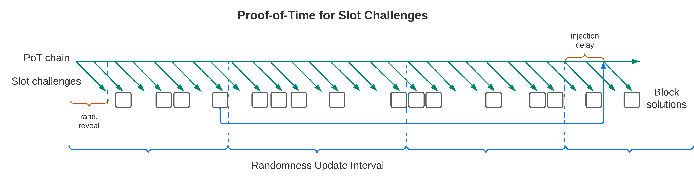
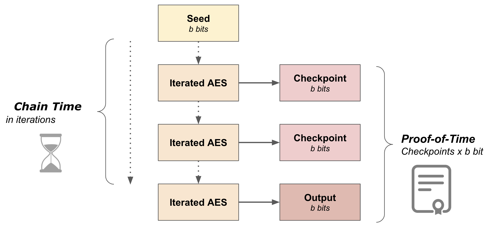

Any energy-efficient proof system implemented in the blockchain setting suffers from the problem of costless simulation, also known as the *nothing-at-stake* problem in Proof-of-Stake context. Proofs-of-time (PoT), or sequential proofs-of-work with deterministic outputs, address this problem. PoTs have been proposed in combination with proofs-of-space, proofs-of-storage, and proof-of-stake. In Subspace, PoTs we combine them with PoAS to obtain a farming dynamic that mimics the random time interval of Bitcoin’s mining dynamic and prevents costless simulation while only expending a small constant amount of electricity for consensus. 
We construct PoT on a pseudorandom permutation (PRP) function based on AES-128. The PRP takes as input a seed and key and outputs a pseudorandom number used as global randomness to challenge farmers and determine slot leaders among domain operators. For an adversary to simulate a proof-of-time, they would have to evaluate the PRP function for the same number of iterations as honest nodes. This requires expending a similar amount of computational resources.

## Workflow

The Proof-of-Time chain starts at the genesis time of the Subspace consensus chain. 

Every slot, the PRP function is evaluated for a set number of iterations to generate fresh global randomness. The Timekeepers, nodes responsible for PoT evaluation, use the same initial seed and key to generate the same output. Sequentiality is achieved by chaining the output of one slot as the seed for the next slot.

Every slot, farmers receive the fresh global randomness and audit their plots to see if they contain any chunks of history close enough to the challenge to claim the block. Farmers that have the correct chunks provide a proof-of-space for those, build a block and earn rewards. The randomness is revealed a few slots in advance to make sure every farmer on the network has enough time to receive it, audit their plots and submit the proof-of-space in case they win. The farmers include PoT outputs in the block header and the PoT chain is persisted in the consensus chain in this way.

Every interval of 18 blocks, randomness from the consensus chain is injected back to the PoT chain to counter any speedups gained by adversarial nodes in the previous interval. This also prevents an adversary from simulation a PoT chain without also having to simulate a consensus chain fork. The injection takes the hash of a deep consensus block header as the new seed for the PRP function.

<!--  -->

## Function Choice
We choose AES for the iterated function because there is already an extremely efficient hardware and software implementation using hardware acceleration instructions, and we don't expect a significant speedup over this.
Every time slot Timekeepers publish the output of AES-128 run for a specified number of iterations. Alongside the output, they publish a set of intermediate checkpoints, currently 8, spaced uniformly. 

<!--  -->

The inclusion of checkpoints allows other nodes to validate the output ~6.5 times faster and using ~4x less power than evaluation by leveraging instruction level parallelism.
On consumer hardware it is estimated that validating the PoT outputs expends ~2.7 kWh of electricity monthly per node, ~80000x less than PoW consensus.
