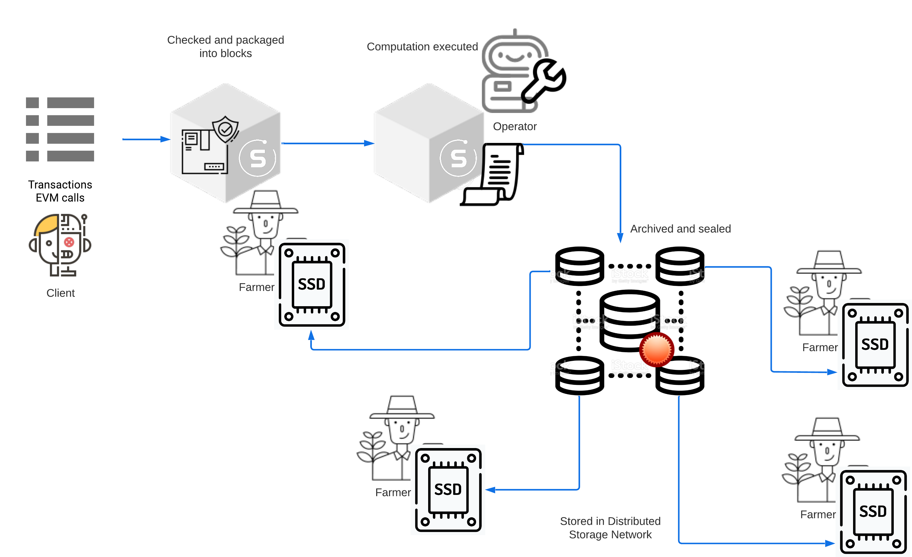
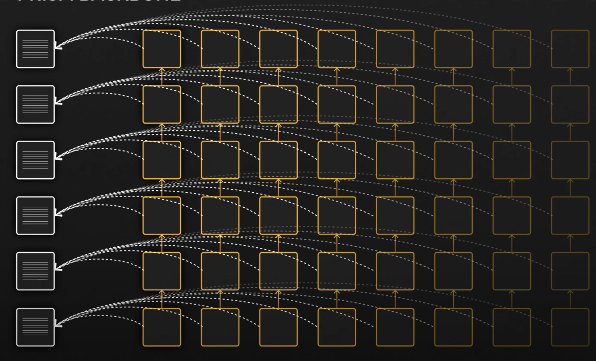

From the moment a transaction is submitted to the Subspace blockchain to the point it is permanently archived, data goes through several stages:
1. Transaction is validated and included in a consensus chain block directly or through inclusions of domain bundles
2. Transactions and bundles in the block are executed, activating a global and domain state change
3. When that block reaches certain depth (currently 100 blocks) it is archived following the Archiving protocol alongside other blocks. At this point it irreversibly becomes a part of Archival History of chain
4. Newly archived pieces are added to farmer caches through the Distributed Storage Network and replicated multiple times throughout the network
5. From there they are encoded into farmer plots on disk for permanent storage, following the Plotting protocol
6. When requested by a client, the original data is reconstructed from archived pieces on the fly
<!--  -->

## Block Structure

A Subspace consensus chain block follows the general structure of a common block: it consists of a body and a header. The consensus chain block header contains metadata about the block allowing verification of validity of the consensus chain. The body contains transactions and domain bundles. A domain bundle is a deterministically ordered set multiple transactions in a particular domain (e.g. EVM contract calls) grouped together for efficient execution. Each domain bundle can be seen as "a block inside a block" with its own bundle header containing information about the domain, the bundle producer etc. Any given consensus chain block may contain many bundles from different domains without burdening the consensus nodes. Consensus nodes are responsible solely for checking if bundles are well-formed and packaging them within a block. Consensus nodes do not execute any of the computation inside the bundles.

## Consensus Chain Block Header

In Subspace, the consensus block header contains:
- The block number in the chain of blocks
- The hash of the parent block
- The Merkle root of the trie of extrinsics included in this block
- The Merkle root of the state trie after processing this block
- The time slot number claimed by the block producer
- The global randomness at the claimed time slot derived from the proof-of-time chain
- The solution to the slot challenge for the claimed time slot. The solution includes a winning chunk of history, a proof-of-space for the farmer's plot and KZG witness that the winning chunk is indeed a part of the archival history at the claimed height
- The solution range used to find the winning chunk of history
- The signature of the block producer over the header

## Domain Bundle

A bundle contains multiple transactions in a particular domain (e.g. EVM contract calls) grouped together for efficient execution, propagation and inclusion in blocks. In Subspace, a bundle contains a signed header and a list of transactions. A bundle header contains:
- The domain ID (e.g. EVM)
- The operator ID of the bundle producer
- The Merkle root of the trie of transactions included in this bundle
- Execution receipt that should extend the receipt chain
- The size of the bundle body in bytes, used to calculate the storage cost
- The total estimated weight of all extrinsics in the bundle, used to prevent overloading the bundle with compute.
- The time slot claimed by the bundle
- The global randomness at the claimed time slot derived from the proof-of-time chain
- The proof-of-election of the operator as bundle producer for the claimed time slot based on slot challenge and operator's stake in the current epoch

## Domain Block

Each domain is its own application specific blockchain (app-chain), that relies on the consensus chain for data availability, and settlement. 
Domain chains consist of domain blocks, each containing solely the bundles relevant to this specific domain and disregards any transactions concerning other domains. Domain chains have separate namespaced execution environments, while still receiving shared security and interoperability from the consensus chain.

<!--  -->
