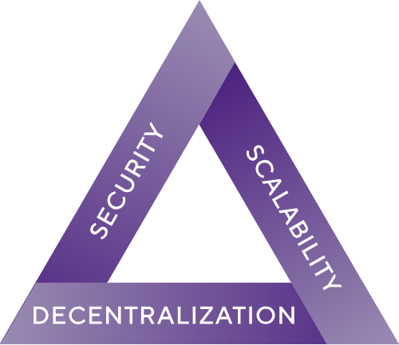

# The Subspace Protocol
Subspace is the first layer-one blockchain that is able to fully resolve the blockchain trilemma. 

We have built Subspace from first principles to achieve scalability, security and decentralization simultaneously. At its core, Subspace introduces a novel storage-based consensus protocol that separates consensus from execution. This allows Subspace to scale transaction throughput and storage requirements independently while maintaining a fully decentralized blockchain.

## Motivation

We have been drawn to the crypto space because of the opportunity it presents for a more open and inclusive future. However, the reality today is far from the dream. We set out to build the Subspace Network to address this gap at a fundamental level and be a network able to realize Nakamoto’s original vision for a more equitable and decentralized future.

Subspace Netwrok was designed from the ground up to achieve this vision - by:

1. Providing an energy-efficient and eco-friendly alternative to crypto mining, which still allows for mass participation by ordinary users.
2. Creating an incentive-compatible network, that resists pooling and is able to encourage and maintain decentralization over the long-term.
3. Scaling the storage and compute capacity of our network proportional to the number of node operators, without sacrificing decentralization or security.
4. Connecting and enabling interoperability between existing networks, to allow for the first truly unified user and developer experience across all of Web3.

We have been very intentional about solving these problems in a manner that reflects our core values. Specifically, we believe that:

- The power to control a blockchain network should be distributed amongst as many stakeholders as possible — we are unapologetic *decentralization maximalists*
- The barriers to entry should be as low as possible, allowing access to anyone who desires to participate — we believe blockchains should be *permissionless systems*
- Everyone who participates in the system should be treated equally, regardless of the resources at their disposal — the network should be *fair for all*

## Scope
Subnomicon provides a comprehensive overview of the Subspace Protocol, covering the following:

1. [Architecture Overview](/docs/overview) - *The Subspace modular architecture.*
2. [Advancing Blockchain](/docs/advancements) - *How Subspace advances the state of blockchain technology.*
3. [Consensus Mechanism](/docs/category/dilithium-consensus) - *How Subspace achieves consensus through its storage-based design.*
4. [Network Architecture](/docs/category/network-architecture) - *How Subspace is structured as a decentralized network.*
5. [Decoupled Execution](/docs/category/decoupled-execution) - *How Subspace separates consensus and computation.*
6. Scalability (Coming soon) - *How Subspace achieves unprecedented scale.*
7. Blockspace Marketplace (Coming soon) - *How Subspace prices blockspace through a two-sided marketplace.*
8. Governance (Coming soon) - *How Subspace protocol is governed by the community.*

## Learn About the Subspace Network 
---
<!-- - [What is the Subspace Network](https://subspace.network/technology)
- [Frequently Asked Questions](https://subspace.network/faq) -->
- [Whitepaper - *Summarized*](https://subspace.network/news/subspace-network-whitepaper)
- [Whitepaper - *Full Length*](https://assets.website-files.com/61526a2af87a54e565b0ae92/617759c00edd0e3bd279aa29_Subspace_%20A%20solution%20to%20the%20farmer%27s%20dilemma.pdf)

